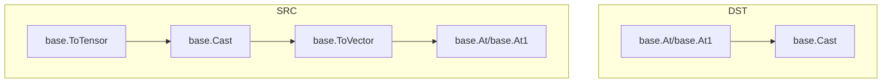

```mermaid
graph TD
subgraph DST
    t_at[base.At/base.At1] --> t_cast[base.Cast]
end
subgraph SRC
    to_tensor[base.ToTensor] --> cast[base.Cast]
    cast --> to_vector[base.ToVector]
    to_vector --> at[base.At/base.At1]
end
```