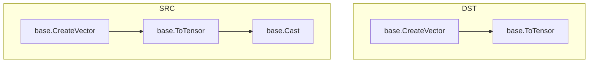

```mermaid
graph TD
subgraph DST
    t_create_vector[base.CreateVector] --> t_to_tensor[base.ToTensor]
end
subgraph SRC
    create_vector[base.CreateVector] --> to_tensor[base.ToTensor]
    to_tensor --> cast[base.Cast]
end
```