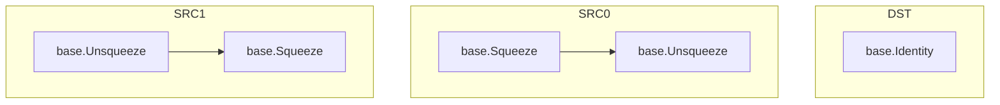

```mermaid
graph TD
subgraph DST
    t_identity[base.Identity]
end
subgraph SRC0
    SRC0_squeeze[base.Squeeze] --> SRC0_unsqueeze[base.Unsqueeze]
end
subgraph SRC1
    SRC1_unsqueeze[base.Unsqueeze] --> SRC1_squeeze[base.Squeeze]
end
```