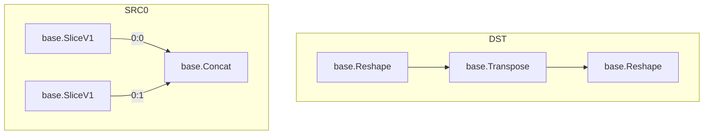

```mermaid
graph TD
subgraph DST
    t_reshape_src[base.Reshape] --> t_transpose[base.Transpose]
    t_transpose --> t_reshape_dst[base.Reshape]
end
subgraph SRC0
    SRC0_slice_0[base.SliceV1] --> |0:0| SRC0_concat[base.Concat]
    SRC0_slice_1[base.SliceV1] --> |0:1| SRC0_concat[base.Concat]
end
```