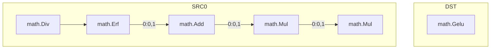

Gelu pattern

```mermaid
graph TD
subgraph DST
    t_reshape_src[math.Gelu]
end
subgraph SRC0
    SRC0_div[math.Div] --> SRC0_erf[math.Erf]
    SRC0_erf --> |0:0,1| SRC0_add[math.Add]
    SRC0_add --> |0:0,1| SRC0_mul[math.Mul]
    SRC0_mul --> |0:0,1| SRC0_mul2[math.Mul]
end
```