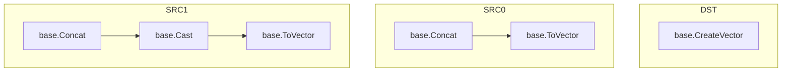

```mermaid
graph TD
subgraph DST
    t_create_vector[base.CreateVector]
end
subgraph SRC0
    s0_concat[base.Concat] --> s0_to_vector[base.ToVector]
end

subgraph SRC1
    s1_concat[base.Concat] --> s1_cast[base.Cast]
    s1_cast --> s1_to_vector[base.ToVector]
end
```