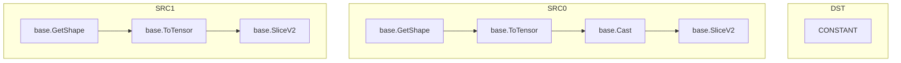

```mermaid
graph TD
subgraph DST
    CONSTANT
end
subgraph SRC0
    s0_get_shape[base.GetShape] --> s0_to_tensor[base.ToTensor]
    s0_to_tensor --> s0_cast[base.Cast]
    s0_cast --> s0_slicev2[base.SliceV2]
end
subgraph SRC1
    s1_get_shape[base.GetShape] --> s1_to_tensor[base.ToTensor]
    s1_to_tensor --> s1_slicev2[base.SliceV2]
end
```