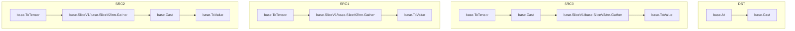

```mermaid
graph TD
subgraph DST
    t_at[base.At] --> t_cast[base.Cast]
end
subgraph SRC0
    SRC0_to_tensor[base.ToTensor] --> SRC0_cast[base.Cast]
    SRC0_cast --> SRC0_slicev2_or_gather[base.SliceV1/base.SliceV2/nn.Gather]
    SRC0_slicev2_or_gather --> SRC0_to_value[base.ToValue]
end
subgraph SRC1
    SRC1_to_tensor[base.ToTensor] --> SRC1_slicev2_or_gather[base.SliceV1/base.SliceV2/nn.Gather]
    SRC1_slicev2_or_gather --> SRC1_to_value[base.ToValue]
end
subgraph SRC2
    SRC2_to_tensor[base.ToTensor] --> SRC2_slicev2_or_gather[base.SliceV1/base.SliceV2/nn.Gather]
    SRC2_slicev2_or_gather --> SRC2_cast[base.Cast]
    SRC2_cast --> SRC2_to_value[base.ToValue]
end
```