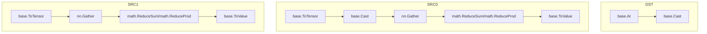

```mermaid
graph TD
subgraph DST
    t_at[base.At] --> t_cast[base.Cast]
end
subgraph SRC0
    SRC0_to_tensor[base.ToTensor] --> SRC0_cast[base.Cast]
    SRC0_cast --> SRC0_gather[nn.Gather]
    SRC0_gather --> SRC0_reduce[math.ReduceSum/math.ReduceProd]
    SRC0_reduce --> SRC0_to_value[base.ToValue]
end
subgraph SRC1
    SRC1_to_tensor[base.ToTensor] --> SRC1_gather[nn.Gather]
    SRC1_gather --> SRC1_reduce[math.ReduceSum/math.ReduceProd]
    SRC1_reduce --> SRC1_to_value[base.ToValue]
end
```